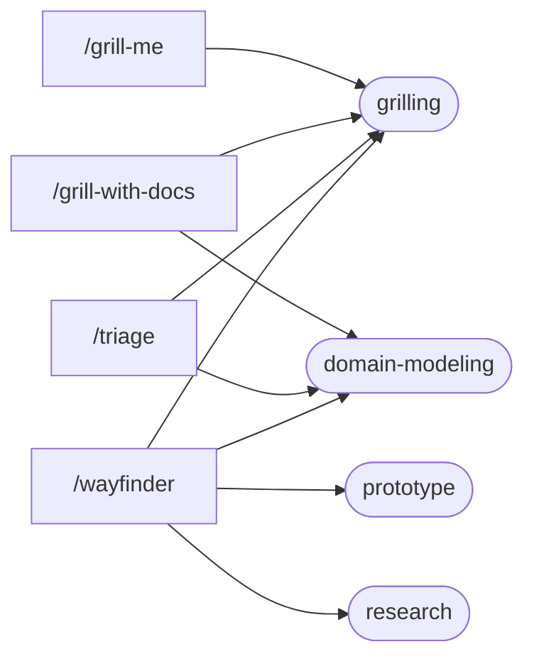

# Skill Catalog

Every skill in this repo: what it does, when to reach for it, and how to invoke it.

25 skills. **Six install by default** (`skills/`), the other **19 are held back** in `extras/` so the starting point stays small. Everything here installs by name:

```bash
./install.sh --list          # every name
./install.sh <name> ...      # add any of them, from either group
./install.sh --all           # all 25
```

New to skills? Read [TEAM-GUIDE.md](TEAM-GUIDE.md) instead. This page is the reference.

## How invocation works

| Badge | Meaning |
|---|---|
| **`/slash`** | User-invoked only (`disable-model-invocation: true`). Claude will *not* reach for it on its own. You type it. |
| **auto** | Claude may pull it in automatically when the task matches its description. You can also invoke it by name. |

14 skills are slash-only, 11 are auto. An auto skill costs a little context on every turn, because its description stays loaded so Claude knows it exists; a slash-only skill costs nothing until you type it. That is the main reason not to install all 25 by reflex.

Nothing turns itself on at session start. For an always-on behaviour like `/i-have-adhd`, invoke it yourself at the top of the session.

---

# Flows

A skill on its own is useful. The value compounds when you chain them, because each one hands the next a better starting point: an interview produces a spec, a spec produces tickets, a ticket produces a reviewed change.

## Two ways skills connect

**Calls** happen automatically. `/grill-me` is one line: "call the Skill tool with grilling". You type one name and the engine underneath does the work. Nothing for you to do.

**Sequences** are yours to drive. Nothing chains `/to-spec` into `/to-tickets`; you run one, look at what came out, then run the next.

The call graph is small, and two skills sit under almost everything:



`grilling` and `domain-modeling` are the engines: an interview discipline, and a glossary discipline. Several skills are wrappers that point them at a different problem. That is why both ship in the starter set even though you never type either.

You never have to satisfy this graph by hand. Installing a skill by name pulls in everything it calls, so `./install.sh wayfinder` also brings `prototype` and `research`. Run `python scripts/check-connections.py` to verify the graph after editing any skill.

## The main flow: request to shipped

```
/grill-with-docs  ->  /to-spec  ->  /to-tickets  ->  /implement  ->  code-review
   align on what          write it       split it        build one       check it
   is actually wanted     down           into slices     slice
```

Keep the first three in **one unbroken context window**, so the spec is written by a session that heard the whole interview rather than a summary of it. Then `/clear` between each `/implement`, because each ticket is self-contained and the last one's context is dead weight.

Everything after `/grill-with-docs` needs `/setup-skills` run once in that repo first.

## Pick a flow by situation

| The situation | The flow | Installed by default? |
| --- | --- | --- |
| A vague request landed and you are not sure what is actually wanted | `/grill-with-docs` | yes |
| Same, but there is no repo (a plan, a proposal, a decision) | `/grill-me` | yes |
| You now know what to build, and it is more than a session's work | `/grill-with-docs` -> `/to-spec` -> `/to-tickets` -> `/implement` | needs extras |
| You know what to build and it is small | `/grill-with-docs` -> build it | yes |
| Numbers are wrong and you do not know why | `diagnosing-bugs` | needs extras |
| You inherited something undocumented | `/grill-with-docs` (it challenges you against the code) | yes |
| An effort so big you cannot see the route yet | `/wayfinder` -> then rejoin at `/to-spec` | needs extras |
| The answer lives in someone else's head | `/to-questionnaire` | needs extras |
| Raw bug reports and requests are piling up | `/triage` -> then `/implement` | needs extras |
| Claude said something and you did not follow it | `/wait-what` | yes |
| Session is long, or you are stopping for the day | `/handoff` | yes |

## Worked examples

### 1. A dashboard request with three hidden decisions

> **INS-482** *Add average wait time by service to the weekly ops dashboard.*

One sentence, and at least three unsettled decisions inside it. **Average** could be mean or median, and for wait times those differ a lot. **Wait time** could be measured from queue entry to answer, or to resolution, and abandoned calls either count or they do not. **By service** is a grain question hiding as a grouping. **Weekly** could be calendar weeks or rolling seven days.

Guess wrong on any one and you build the wrong number, correctly.

```
/grill-with-docs
```

It works the open decisions in rounds, giving you numbered questions with its recommended answer for each, so agreeing is one word and disagreeing is one sentence. As each lands it writes the term into `CONTEXT.md`, which means the next person to touch wait times inherits the definition instead of re-deriving it.

Then, if it is more than a session's work:

```
/to-spec        # the conversation becomes a written spec on Jira
/to-tickets     # split into slices, each declaring what blocks it
/implement      # one slice, fresh context each time
```

**Starter-set version:** run `/grill-with-docs` and stop there, then build it yourself. You still get the alignment and the glossary, which is where most of the value is.

### 2. The numbers do not match

> *"Weekly report shows about 12% fewer calls than the source system for last month. Can you take a look?"*

The instinct is to open the model and start reading SQL. That is the failure this skill exists to prevent.

```
diagnosing-bugs
```

It will not theorise until there is a **tight loop**: one command that already goes red on this specific discrepancy. For data work that is rarely a full build. It is a scoped query, pinned to one day where the gap reproduces, run against dev, returning the difference as a number you can watch change. A forty-minute rebuild is not a loop; a four-second query is.

Then it minimises (which day, which service, which channel still shows the gap), then it makes you rank three to five falsifiable hypotheses before testing any. For a count discrepancy those usually include: late-arriving rows the incremental never picked up, a timezone boundary putting rows in the wrong day, a join fanning out and then being deduped, or a filter on a column that is null more often than anyone expected.

Ranking before testing matters because the first plausible idea anchors you, and in reconciliation work the first plausible idea is usually the timezone.

### 3. You inherited a model nobody documented

> *`fct_service_episodes`, 400 lines, no description, and the person who wrote it has left.*

Read it, form a view, then get challenged on it:

```
/grill-with-docs
```

Say what you think the model does. `domain-modeling` cross-references your account against the SQL and pushes back where they disagree: *"you said an episode closes when the referral is actioned, but the model also closes it on a 30 day timeout. Which is right?"*

That contradiction is the thing you needed to find, and reading the file alone would not have surfaced it. Every term you settle goes into `CONTEXT.md`, so the next person inherits your afternoon of work instead of repeating it.

When an explanation comes back as jargon soup:

```
/wait-what
```

### 4. A migration you cannot see the end of

> *Move the Athena and Qlik reporting layer onto Snowflake and dbt.*

Months of work, and the route is not visible yet. `/to-spec` would produce fiction, because you cannot spec what you have not decided.

```
/wayfinder
```

It charts a **map** on the tracker: not tasks, but the open *decisions*, each as its own ticket with its blockers declared. Which models move first. Whether history is backfilled or cut over. What happens to the Qlik extracts during the overlap. You resolve them one per session, and each answer clears the fog enough to see the next few.

It produces **decisions, not deliverables**. When the route is clear, rejoin the main flow at `/to-spec`.

Needs `/setup-skills` first, and it is the most demanding thing in this repo. Do not reach for it on a well-scoped feature.

### 5. The answer is not yours to give

> *Does "active client" mean the same thing in our marts as it does in Finance's reporting?*

You cannot answer it and neither can Claude.

```
/to-questionnaire
```

It interviews you about the **send** rather than the subject, which is the part you can always answer: who is receiving this, what do they know that you do not, what do you need to walk away able to decide. Then it writes a Markdown questionnaire aimed at that gap, which you send or work through in a meeting.

What comes back is material for `/grill-with-docs`.

---

# The starter set (6)

Installed by default. No setup, no repo writes unless you ask.

### `/grill-me` — slash
A relentless interview about a plan or design, worked as rounds of numbered questions, each with a recommended answer, until every open decision is settled. Stateless: it saves nothing. Reach for it before building anything you have not fully thought through, in or out of a repo.

### `/grill-with-docs` — slash
The same interview, aimed at a repo. As decisions land it writes them down: terms into a `CONTEXT.md` glossary, hard-to-reverse choices into ADRs. Strictly better than `/grill-me` when you are in a working directory, because it leaves a paper trail the next session can read.

### `/wait-what` — slash
Fire it the moment an answer does not land. Claude re-pitches what it just said in plain English, using the project's own vocabulary. Seven lines long, and the quickest way to understand what a skill is.

### `/handoff` — slash
Compacts the current conversation into a handoff document so a fresh session, or another person, can pick the work up. Reach for it when a session is getting long, when you are switching machines, or at the end of the day.

### `grilling` — auto
The interview engine: the design tree, the frontier, rounds of questions. Facts are the agent's job, decisions are yours. `/grill-me` and `/grill-with-docs` both call it. You can invoke it directly if you want the interview with no wrapper.

### `domain-modeling` — auto
The active discipline behind the glossary: challenge a fuzzy term, resolve an overloaded word, stress-test a definition against edge cases, and record decisions as ADRs. Called by `/grill-with-docs`.
*Bundle: `CONTEXT-FORMAT.md`, `ADR-FORMAT.md`.*

---

# Extras (19)

Held back, not removed. Install any by name.

## Getting started with the rest

### `/which-skill` — slash
The router over everything here. Describes the main flow (idea to ship), the on-ramps that merge onto it, and what is standalone. Reach for it when you know you want a skill but not which one.
*Bundle: `PHASE-BOUNDARIES.md`, when to continue vs `/clear` vs `/handoff` vs subagent vs `/compact`.*

### `/setup-skills` — slash
One-time per-repo configuration: which issue tracker you use (GitHub, Jira, or local markdown), the triage label vocabulary, and where `CONTEXT.md` and ADRs live. **Required before `/to-spec`, `/to-tickets`, `/triage` and `/wayfinder`**, which read the files it writes.
*Bundle: seed templates for `issue-tracker-{github,jira,local}.md`, `triage-labels.md`, `domain.md`.*

## The main flow: idea to ship

These chain in order. Keep the first steps in one context window, then `/clear` between each `/implement`. All of them need `/setup-skills` first.

### `/to-spec` — slash
Turns the conversation you just had into a written spec on the tracker. No second interview: it synthesises what is already known, settles which modules and seams you are touching, and publishes.

### `/to-tickets` — slash
Breaks a plan or spec into tracer-bullet tickets, each a narrow but complete slice, each declaring what blocks it. Handles wide mechanical refactors as expand-migrate-contract instead of forcing them into a slice.

### `/implement` — slash
Builds the work described by a spec or ticket, testing at pre-agreed seams and closing out with a review before committing.

### `code-review` — auto
Reviews the diff since a fixed point on two axes at once: **Standards** (does it follow this repo's conventions, plus a code-smell baseline) and **Spec** (does it do what the ticket asked). Runs both as parallel sub-agents so neither colours the other.
**Note:** installing this overrides Claude Code's built-in `/code-review`.

## When something comes up

### `/triage` — slash
Moves incoming issues through a state machine of triage roles, verifying the claim, grilling where the request is thin, and writing agent-ready briefs. For issues you did not write. Needs `/setup-skills`.
*Bundle: `AGENT-BRIEF.md`, `OUT-OF-SCOPE.md`.*

### `diagnosing-bugs` — auto
A disciplined loop for hard bugs and performance regressions. It refuses to theorise until it has a **tight** feedback loop that already goes red on this specific bug, then minimises, hypothesises, instruments, fixes, and locks it down with a regression test.
*Bundle: `scripts/hitl-loop.template.sh`.*

### `/wayfinder` — slash
For an effort too big for one session and still wrapped in fog. Charts a shared map of decision tickets on the tracker and resolves them one at a time until the route is clear. Produces decisions, not deliverables. The most demanding thing here. Needs `/setup-skills`.

## Supporting

### `research` — auto
Sends a background agent to investigate a question against primary sources and leave a cited Markdown file behind. You keep working while it reads.

### `prototype` — auto
Throwaway code that answers one design question. Kept as a primary source on its own branch once the answer is folded back in.
*Bundle: `LOGIC.md`, `UI.md`.*

### `resolving-merge-conflicts` — auto
Works an in-progress merge or rebase hunk by hunk, resolving by intent traced back to each side's original reason rather than by picking lines. Never aborts.

### `wizard` — auto
Generates an interactive bash script for steps only a human can take: provisioning, credentials, CI secrets, clicking through an unfamiliar dashboard, a one-off cutover.
*Bundle: `template.sh`.*

### `git-guardrails-claude-code` — auto
Sets up Claude Code hooks that block dangerous git commands (force push, `reset --hard`, `clean`, `branch -D`) before they execute. **Writes to your Claude Code settings.**
*Bundle: `scripts/block-dangerous-git.sh`.*

### `karpathy-guidelines` — auto
The on-demand twin of this repo's `CLAUDE.md`: state assumptions, keep it simple, make surgical changes, define success criteria. Use this **or** the always-on `CLAUDE.md`, never both.

## Thinking, writing and comms

### `/teach` — slash
Teaches you a concept across multiple sessions, using the current directory as a stateful workspace with lessons, a glossary and learning records.
*Bundle: `MISSION-FORMAT.md`, `GLOSSARY-FORMAT.md`, `LEARNING-RECORD-FORMAT.md`, `RESOURCES-FORMAT.md`.*

### `/to-questionnaire` — slash
When the answer lives in someone else's head, this writes them a questionnaire. It interviews you about the **send** (who it is for, what you need back) rather than the subject, and aims the questions at the gap.

### `/i-have-adhd` — slash
Reshapes output: answer first, numbered steps, state restated each turn, no filler, wins made visible. Stays on until you say "stop adhd mode". Invoke at the top of a session.

### `writing-for-agents` — auto
How to write documents agents read well: skills, `CLAUDE.md`, and anything reached by a pointer. Read it before adding or editing a skill in this repo.
*Bundle: `SKILL-MECHANICS.md`.*
